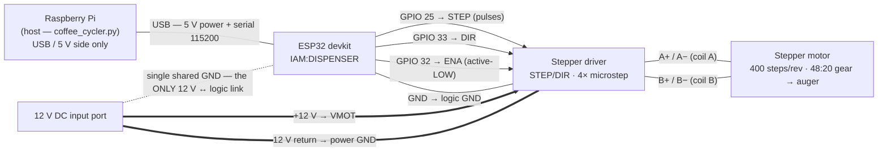

# Dispenser Wiring

Wiring reference for the **DISPENSER** assembly (ESP32 + stepper driver + auger motor).
All pin numbers and behavior come from [`AUTOCYCLER_DISPENSOR/AUTOCYCLER_DISPENSOR.ino`](../AUTOCYCLER_DISPENSOR/AUTOCYCLER_DISPENSOR.ino).

> **⚡ The Pi never touches 12 V.** The Raspberry Pi connects to this assembly through the USB
> cable alone (data + the ESP32's 5 V supply). The 12 V input feeds only the stepper driver's
> motor stage. The two power domains share exactly **one** wire: ground. If you ever find a
> second 12 V-side connection to the Pi or ESP32, that's a wiring fault.

## Overview

Line styles: `-->` 3.3 V logic signal · `==>` 12 V power · `-.-` the shared-ground bond · `---` USB / coil / ground wiring.

## ESP32 → stepper driver (logic side)

| ESP32 pin | Driver terminal | Signal | Behavior (from firmware) |
|---|---|---|---|
| **GPIO 25** | STEP / PUL | Step pulses | 420 µs high / 420 µs low per microstep (`STEP_DELAY_MICROS`) |
| **GPIO 33** | DIR | Direction | Level set once before each move (sign of the commanded degrees) |
| **GPIO 32** | ENA | Enable — **active LOW** | Driven HIGH (disabled) at boot. `SET ANGLE` enables for the move then re-disables; `SET MOTOR ON` holds it enabled for position hold |
| GND | GND (logic) | Signal return | Reference for the three GPIO signals |

## 12 V input → stepper driver (power side)

| 12 V port | Driver terminal | Notes |
|---|---|---|
| **+12 V** | VMOT / VCC | Motor supply only — never routed to the ESP32 or Pi |
| **GND** | GND (power) | Bonded to logic ground: the single shared-ground point in the diagram |

## Stepper driver → motor

| Driver | Motor lead | Notes |
|---|---|---|
| **A+ / A−** | Coil A pair | 4-wire bipolar stepper. If the motor buzzes without turning, one coil pair is split across A and B — swap leads until each pair reads continuity |
| **B+ / B−** | Coil B pair | |

## Raspberry Pi → ESP32 (USB)

| Carries | Detail |
|---|---|
| **5 V power** | Powers the ESP32 board entirely — no other supply on the logic side |
| **Serial 115200** | `WHO AM I` · `SET ANGLE <deg> [seq]` · `GET STATUS` · `SET MOTOR ON/OFF` · `GET VERSION` — auto-discovered by the app, no fixed port needed |

## Bench notes

- **Driver DIP switches must be set to 4× microstepping.** The firmware's `MICROSTEPPING 4` is a
  constant, not a command — a driver set differently scales every dose. 3 840 microsteps = one auger
  revolution = `SET ANGLE 360` ≈ 19 g.
- **Motor EMI corrupts serial acks.** The move ack is deliberately delayed `ACK_SETTLE_MS` (75 ms)
  after the last step so it isn't transmitted inside the coil switching transients. Keep the USB
  cable routed away from the motor leads.
- **Enable is active-low** on the driver: logic LOW on ENA energizes the coils. The board boots with
  the driver disabled, so a freshly powered dispenser is always free-spinning.
- **Steps/rev discrepancy to verify:** the code uses 400 steps/rev (a 0.9° motor) but its comment
  says "1.8° motor" (which would be 200). The field-calibrated ~19 g dose implies the 400 is right —
  worth confirming against the motor's nameplate before any dose retune.
- Moves are **relative** and capped at `MAX_DISPENSE_DEG` 1080° (3 revolutions) as a
  garbled-command guard.
