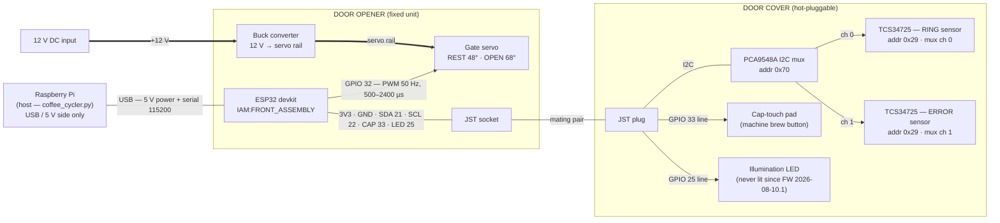

# Front Assembly Wiring — Door Opener + Door Cover

Wiring reference for the **FRONT_ASSEMBLY** hardware, which is split across two units joined by
a JST connector pair:

- **Door opener** — the fixed unit: ESP32 devkit, gate servo, 12 V input + buck converter,
  USB to the Pi, and the JST socket.
- **Door cover** — the removable, **hot-pluggable** unit that sits over the machine's door
  indicators: the I2C mux, both TCS34725 color sensors, the cap-touch pad, and the
  (now unused) illumination LED, all leaving on the JST plug.

All pin numbers and behavior come from
[`AUTOCYCLER_FRONT/AUTOCYCLER_FRONT.ino`](../AUTOCYCLER_FRONT/AUTOCYCLER_FRONT.ino)
(FW `2026-08-10.1`).

> **⚡ The Pi never touches 12 V.** The Pi connects through the USB cable alone (data + the
> ESP32's 5 V supply). The external 12 V input feeds only the buck converter, and the buck's
> output feeds only the servo. The 12 V domain meets the logic domain at a single shared
> ground. If a second 12 V-side connection to the Pi or ESP32 ever appears, that's a wiring fault.

> **🔌 The door cover is hot-pluggable — by design.** It can be absent at boot, unplugged
> mid-run, and re-plugged at any time. Every color read re-establishes the whole I2C chain
> (`ensureSensor`) before trusting it, so nothing about the cover is assumed from startup.

## Overview

Line styles: `-->` logic signal · `==>` power · `---` bus / power+data bundle.

## JST interconnect (door opener ⇄ door cover)

Everything the cover needs rides this one connector — unplugging it removes the entire I2C
chain **and** the cap-touch pad at once.

| Pin | Opener side (ESP32) | Cover side | Function |
|---|---|---|---|
| **3V3** | 3.3 V rail | Mux + both sensors | Cover logic power |
| **GND** | GND | Common | Signal return |
| **SDA** | GPIO 21 (`Wire` default) | PCA9548A SDA | I2C data |
| **SCL** | GPIO 22 (`Wire` default) | PCA9548A SCL | I2C clock |
| **CAP** | GPIO 33 | Cap-touch pad | Brew-button press — driven LOW = pressed, high-impedance (INPUT) = released |
| **LED** | GPIO 25 | Illumination LED | **Legacy — never driven HIGH since FW 2026-08-10.1** (its bounce off the semi-reflective panel dominated the sensors) |

## The I2C chain on the cover

| Device | Address | Notes |
|---|---|---|
| PCA9548A mux | `0x70` | Selects exactly one sensor channel at a time; the control register is **read back after every switch** (`muxSelect`) to prove it latched |
| TCS34725 — RING | `0x29`, mux **ch 0** | Watches the 24-LED ring: blue "time to go" ready glow, green brew-complete flash |
| TCS34725 — ERROR | `0x29`, mux **ch 1** | Watches the Maintenance status icon: idle ~white; red / yellow / blue are faults |

Both sensors share address `0x29` — **the mux is the only thing that tells them apart**. That's
why the host asks `GET COLOR <sensor> TAG` and discards any reply naming the wrong sensor, and
why the firmware verifies the mux register after switching.

## Door opener

### Servo (the coffee gate)

| Connection | Detail |
|---|---|
| Signal | **GPIO 32** — 50 Hz PWM, 500–2400 µs pulse range |
| Power | **Buck converter output** (from the external 12 V input) — *not* the ESP32's USB 5 V |
| Ground | Buck/servo ground bonded to ESP32 logic ground (the single shared-ground point) |
| Positions | `SERVO_REST` **48°** = gate closed · `SERVO_OPEN` **68°** = gate open |
| Boot state | Drives to 48° (closed) immediately in `setup()` |
| Idle state | The app parks the gate **OPEN** between runs; every cycle closes it before dispensing |

### 12 V input → buck → servo

| From | To | Notes |
|---|---|---|
| **+12 V** port | Buck VIN | Feeds the buck only — never the ESP32 or Pi |
| Buck VOUT | Servo + | Set the buck to the servo's rated voltage before connecting |
| **GND** | Buck GND / servo − / ESP32 GND | Single shared ground across 12 V and logic domains |

### Raspberry Pi → ESP32 (USB)

| Carries | Detail |
|---|---|
| **5 V power** | Powers the ESP32 (and through it the cover's 3V3 rail) — the servo does **not** draw from this |
| **Serial 115200** | `WHO AM I` · `GET COLOR <ERROR\|RING> [TAG]` · `SET SERVO <0-180>` · `SET CAP ON/OFF` · `GET VERSION` — auto-discovered by the app |

## Cap touch (the brew button)

- `SET CAP ON` drives GPIO 33 **LOW** (OUTPUT); `SET CAP OFF` returns it to **high-impedance**
  (INPUT). The pad capacitively "presses" the machine's start button.
- **15 s failsafe** (`CAP_MAX_ON_MS`): if the host dies with CAP asserted, the firmware
  auto-releases and prints `EVENT:CAP_AUTORELEASE` — the brew button can never be held forever.
- The host asserts CAP from exactly two places (`_trigger_brew`, `_do_cap_reset`), both reachable
  only from a requested run — pinned by a test so the cycler can never brew unasked.

## Bench notes

- **Unplug / replug behavior:** cover absent at boot → `EVENT:DOOR_COVER_ABSENT`, board stays
  alive and answers everything except color reads (`ERROR:door cover not detected (no I2C mux)`).
  Unplugged mid-run → the error-light watcher halts the run (no error light = no fault detection,
  by design). Re-plugging recovers with no reboot: `ensureSensor` re-inits only what the ENABLE
  check proves was power-cycled.
- **A dark sensor is data, not a fault.** Since FW `2026-08-10.1` a verified sensor seeing no
  light answers `RGB:0,0,0` (an unlit indicator), not an error. The illumination LED never
  lights — both sensors read only the machine's own emission, which is what the color
  thresholds are calibrated against.
- **A pulled cover can jam the I2C bus** (a device left holding SDA low mid-transfer). The
  firmware clocks the bus free (`i2cRecover`) on the failure path automatically — if color reads
  fail after a rough unplug, just re-issue; no power cycle needed.
- **Servo power must come from the buck.** Driving the servo from the ESP32's USB 5 V rail
  brownouts the board mid-swing — the split exists on purpose; keep it.
- The cap-touch line runs through the JST, so **removing the cover also removes the ability to
  press the brew button** — a fully unplugged cover is a safe state on both sensing and actuation.
